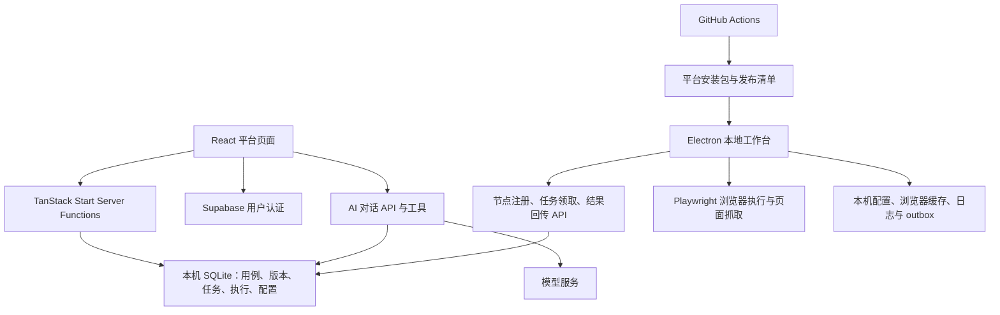

# PlayFlow 项目分析（2026-09-10）

分析基线：`88bf04b`（添加了用例筛选与全选功能），应用版本 `1.8.2`。

## 判断与证据边界

项目已具备真实的用例管理、Agent 浏览器执行和 AI 辅助能力，适合继续做内部试用验证。当前主要问题不是页面数量，而是页面设置、接口契约、执行结果与发布产物之间的一致性。尚不能把它视为经过生产验收的自动化测试平台。

本次核查代码、路由、SQLite 访问层、Agent、CI；运行了类型检查、Lint、Agent CJS 语法检查和首页 HTTP 检查。子代理另使用内存 stub 验证执行起始地址、录制转换及块解析，并用 shell 验证产物分类。没有真实执行被测业务、注册节点、调用付费 AI、修改业务数据库、下载或验证正式安装包。HTTP 200 和类型通过不代表所有业务链路验收通过。

分析开始时 `.data/cases.db` 已有本地改动；本次保留。仅新增本分析文档。

## 实际架构

- 前端：React 19、TanStack Router/Start、Tailwind 4、Radix 组件；主要业务状态保存在 `store.ts` 的全局订阅缓存中，平台外壳每 3 秒读取快照。React Query Provider 存在，但核心业务没有采用按资源独立缓存的查询方式。
- 服务端：多数 CRUD 使用 Server Functions；Agent、AI 对话与截图使用 HTTP 路由。Zod 负责大部分入参校验。
- 存储：当前业务主路径使用 SQLite；`platform.server.ts` 的 `db()` 和 `agent-db.server.ts` 的 `admin()` 都返回本地客户端。保留的 Supabase 类型与方法名不意味着这些数据仍保存在云端。
- 用户与设备是两种身份：平台用户走 Supabase 会话；Agent 走节点标识和节点令牌。目前两种访问边界均未完全统一。
- 调度：没有独立队列服务；平台生成排队中的执行记录，Agent 轮询接单。任务聚合终态由读取平台快照触发。
- 默认数据文件是 `.data/cases.db`，且仍被 Git 跟踪。需要持久磁盘和 SQLite 运行时；不能仅凭 Web 构建成功推断可部署到任意无状态或边缘环境。

## 功能成熟度

| 模块 | 已有真实实现 | 当前缺口 |
| --- | --- | --- |
| 登录 | 邮箱密码登录/注册、会话读取、页面跳转 | 多数业务接口没有对应服务端身份校验 |
| 用例 | CRUD、筛选、模板派生、参数绑定、版本历史、回滚、脚本导出 | 保存成功提示早于请求完成；版本写入缺并发保护 |
| 编排 | 拖拽积木、流程图、条件与循环、脚本生成 | 不合法块结构可能被静默截断；脚本展示与执行解释器分离 |
| 任务 | 批量选择、按模块/状态筛选、全选、节点选择、串行依赖、手动重跑 | browser/concurrency/retry 未形成完整执行契约；缺租约及取消闭环 |
| Agent | 本机工作台、托盘、真实浏览器、codegen、日志、离线补传 | 录制语义丢失、长循环结果拒收、安装内核失败不一定终结任务 |
| 报告 | 真实执行状态派生统计、历史列表、AI 分析入口 | 导出/截图/录像入口仍含演示提示；平台产物链路未完成 |
| AI | 流式对话、多模型配置、真实数据查询、生成用例预览后保存、Agent 页面抓取 | 对话接口鉴权缺失；页面会话与缓存隔离不足；生成结构验证不足 |
| 系统配置 | 分页配置、参数覆盖、AI 配置存储 | 邮件、保留天数、录像/Trace 等不能等同于已生效的运行策略 |
| 发布 | Windows/Linux x64、macOS ARM64 CI，可选签名公证 | 产物分类错误、假升级成功、本地 Mac 脚本仍是 x64 |

## 优先处理的问题

### 1. 登录页面没有形成服务端访问边界（优先级高）

`src/lib/platform.functions.ts:19` 的快照读取、`:24` 的保存用例、`:437` 的下发任务均未挂身份校验中间件。`src/components/platform-shell.tsx` 的跳转只作用于浏览器页面；`src/start.ts:29` 的 token 附加和 CSRF 防护不替代服务端身份校验。

`src/routes/api/chat.ts:21` 也未校验登录，可使用服务端配置的模型并调用查询/抓取工具；`src/routes/api/inspect-shot.$id.ts:8` 的截图读取同样缺少身份验证。AI 设置管理等少数功能已有鉴权，说明当前是边界不一致，并非完全没有认证基础。

影响：在服务可访问的部署环境中，绕过页面进入路由或业务函数的请求可能访问数据、触发执行或消耗模型额度。优先统一用户鉴权、资源归属和设备准入策略。

### 2. 结果回传允许覆盖其他执行或已结束状态（优先级高）

`src/routes/api/public/agent/run-report.ts:56` 验证调用者节点令牌后，只按 `runId` 更新，且写入调用者的 `agent_id`。没有约束该记录原本属于此 Agent、当前尝试或可接受状态。

触发：其他合法节点获知执行 ID，或正常网络延迟导致旧执行回包晚于取消/重跑。后果：归属被改写、旧结果覆盖新状态。重复终态还会在 `:64` 重复累计执行数、在 `:76` 重复插入日志。

建议：绑定 run/agent/attempt 或 lease，实施合法状态迁移与终态幂等，并原子提交终态及日志。

### 3. 任务领取后无法可靠恢复（优先级高）

`src/routes/api/public/agent/jobs.ts:19` 先读取排队记录，经过多次异步操作后在 `:149` 无条件更新为执行中；没有比较原状态的原子领取。并发请求有重复领取窗口；实际重现概率受单进程/多进程与请求时序影响。

更直接的问题是：服务端标记执行中后若响应丢失或 Agent 崩溃，没有租约超时回收，下轮只读排队记录，任务可能永久挂起。平台取消状态也没有使正在运行的浏览器可靠中止。

建议：原子领取、心跳续租、过期回收、执行超时、取消确认与迟到报告拒绝一起设计。

### 4. 任务参数与真实浏览器不一致（优先级高）

`jobs.ts:135` 的 job 不含 task browser；`agent-app/main.cjs:320` 也不传 browser；`agent-app/runner.cjs:89` 因此回落 Chromium。平台选择 Firefox/WebKit不会改变这条路径实际运行的浏览器。

runner 在 `:104` 创建空白页后直接运行 steps，没有使用 startUrl。仅填起始地址、首步直接 click/fill 的用例会在空白页上执行。内存 stub 验证结果为 `launch chromium → click #go`，没有 goto。

并发数与自动重试同样没有接入该下发契约；jobs 固定截取最多 3 条，Agent 用 for 循环逐条 await。手动重跑已有实现，但不能当作自动重试已实现。

### 5. 长循环执行成功却无法提交结果（优先级高）

`runner.cjs:158` 每次迭代积累步骤结果，`main.cjs:301` 完整提交；`run-report.ts:17` 限制最多 300 个 steps，`:25` 限制 500 条 logs。有效的 100 次循环、每次 4 个动作会超过步骤上限。

接口因此返回 400，`agent-app/platform.cjs:200` 对 400 不进入离线重试队列，已有执行记录继续停在执行中。应将终态摘要与分批日志/步骤上报分离，不能让诊断数据体积阻断终态。

### 6. 保存和操作成功提示不可信（优先级高）

`src/routes/cases.$caseId.tsx:122` 调用异步 upsertCase 却不 await，立即 toast 成功并跳列表。网络或数据库失败时用户仍以为保存成功。`src/routes/tasks.index.tsx:337` 的列表下发也提前提示成功。

此外，用例页 `:98` 的“本地调试”只弹提示，没有向 Agent 下发；`src/routes/reports.tsx:68` 的导出以及 `:178`、`:182` 的截图/录像仍是演示行为。应统一等待结果、失败提示和提交中状态，并明确未实现入口。

### 7. macOS 发布清单把 darwin 归为 win（优先级高）

`.github/workflows/agent-release.yml:206` 的 shell 模式先匹配 `*win*` 再匹配 `*darwin*`；darwin 包含 win，因此 macOS ZIP 被标为 win。只读 shell 验证了该映射。

版本接口 `src/routes/api/public/agent/version.ts:18` 按 platform 查找，导致 Windows 可能拿到字典序靠前的 macOS 包；macOS 依赖首项回退而偶然工作。应使用明确的平台及架构字段，并拒绝没有匹配产物的升级请求。

### 8. 升级打开 ZIP 后就宣布安装成功（优先级高）

`agent-app/main.cjs:558` 仅调用 shell.openPath，随后上报新 installedVersion、宣称重启并退出旧进程。没有替换 App，也没有验证新进程启动，打开失败也未等待处理。

可先采用明确的手动安装引导；若做自动升级，必须以新版本实际启动并确认作为成功依据。

### 9. 心跳重置累计运行次数（优先级中）

`src/lib/local-db.server.ts:58` 定义节点默认 total_runs=0、created_at=当前时间；`:528` 对 upsert 也填默认值，`:537` 冲突时全部更新。`register.ts:41` 每次心跳 upsert 没传这些字段，因此统计被归零、创建时间被改写。

应区分新建默认值与更新 patch。这个缺陷也是自制 Supabase 风格 SQLite 适配层语义不完全等价的具体表现。

### 10. 任务终态依赖页面刷新且只处理最新 60 条（优先级中）

`src/lib/platform.server.ts:172` 在 loadSnapshot 中调用 reconcileTasks；任务查询在 `:155` 限制 60 条。无人读快照时任务不聚合完成；较老的未结束任务还会被范围排除。

同一快照只取 300 条用例，日志也有全局条数限制，页面的“全部”“总数”和历史统计并非无限量的完整数据。建议让回传或独立任务负责状态收敛，查询 API 显式分页、返回总数并按执行查询日志。

### 11. 版本追溯还不能保证确定性（优先级中）

`platform.functions.ts:80` 读版本、更新用例、插入版本是分离操作；`case-repo-sqlite.server.ts:117` 未以唯一索引约束 case/version。并发保存可能出现同版本不同内容。

`jobs.ts:118` 在历史快照缺失时使用 `snap ?? c ?? {}`，却仍可返回原指定版本号。旧任务可能实际运行最新内容或空步骤。应将快照冻结和版本写入纳入事务，缺失版本明确报错。

### 12. AI 与录制仍有语义边界（优先级中）

- `agent-app/recorder.cjs:88` 起的转换会丢失 nth/exact 信息，并产生 runner 未注册的 label=/placeholder= 选择器。录得出来不等于可准确回放。
- `runner.cjs:55` 的结束块解析缺结构校验；内存测试中 `[endIf, click]` 被解析为空节点，后续动作静默丢弃。AI 生成只过滤关键字名，提示词要求成对闭合不能替代程序校验。
- `agent-app/inspect.cjs:92` 固定无头浏览器，却引导用户在客户端完成登录/验证码；没有可见登录窗口或会话导入闭环。分析登录页本身也可能被误判为登录拦截。
- `src/lib/ai-tools.server.ts:218` 的缓存按 URL 查找，缺设备维度；同一 URL 在不同设备或登录上下文中可能返回另一页面内容。
- inspect 会读取输入框 value，缺敏感字段过滤；结合 AI 工具数据出站，需要明确截图、字段和日志的脱敏边界。

## 存储与部署建议

当前本机 SQLite 方案适合先收敛成单实例内部服务。保留 SQLite 并不妨碍做好事务、租约和权限；不建议为了修可靠性立即替换整个数据库。

但应将运行数据库从源码版本控制中分离，提供初始化/迁移与备份恢复流程。反复 git 同步现在会与业务数据发生冲突，不能把下载新版代码当成更新生产数据库的方式。

`CASE_DB_DRIVER=supabase` 的回退也需修正：`case-repo.server.ts:95` 调用的 admin() 已变为 localClient，而该适配层 SCHEMA 不含 test_cases/case_versions。当前不能宣称支持自由切换云端存储。

未来若要求多项目、多用户或公网部署，再明确项目归属、角色、用户/节点准入、持久存储与产物访问控制，然后决定是否迁移共享数据库。

## macOS ARM64 最新结论

当前 CI 已有 darwin/arm64 矩阵、ad-hoc 签名，以及配置证书后的 Developer ID 签名和 Apple 公证路径。此前“完全没有签名公证流程”的结论已过时。

但尚未核实仓库 Secrets、成功发布记录或实际安装包的公证状态。构建配置存在不等于正式产物已通过验证。本地 agent:pack:mac 仍为 x64，且本地 node_modules 忽略规则与 CI 不一致。先修清单分类和升级误报，再进行 Apple Silicon 实机安装、注册、浏览器下载、执行与升级验收。

## 本次验证

| 检查 | 结果 | 范围 |
| --- | --- | --- |
| TypeScript `tsc --noEmit` | 通过 | 当前本地依赖与 TS 配置 |
| Agent `node --check` | 全部通过 | `.cjs` 语法，不代表浏览器行为正确 |
| ESLint | 1261 errors / 18 warnings | 1165 格式问题；94 any；1 prefer-const；1 no-useless-escape；18 热更新导出警告 |
| 首页 HTTP | 200 | 服务可响应，不代表登录或任务 E2E 通过 |
| 定向纯逻辑核查 | 复现产物分类、startUrl 忽略及转换/解析问题 | shell / 内存 stub，未运行实际测试站点 |
| 回归测试体系 | 未发现项目业务测试套件及 test script | 现有 CI 有 Web 构建和打包，未看到业务回归门禁 |

Lint 数量主要反映格式与类型治理债务，不能等同于 1261 个功能故障。本次没有运行生产构建或实际 Agent 端到端验收。

## 建议实施顺序（尚未执行）

1. 先让结果可信：保存/下发 await 与错误提示，浏览器/起始地址契约，长结果终态提交，领取/取消/重跑/幂等保护。
2. 同期补访问边界：平台 API 与 AI 鉴权、run 归属、节点准入；若公网使用，这一项是发布前置条件。
3. 让交付可信：修产物分类，明确手动/自动升级，完成 macOS ARM64 实机验收。
4. 完成可追溯闭环：版本事务、后台状态收敛、分页、截图/录像/Trace 存储和访问、数据迁移与备份。
5. 再扩展 AI：录制定位器语义、生成结构验证、登录页面抓取、缓存隔离和敏感信息过滤。

首轮建议验收：新建保存后刷新仍存在；Firefox 任务日志和真实引擎一致；长循环最终收尾；Agent 中断后任务可恢复；取消后的迟到结果不覆盖终态；失败截图可从平台打开；新版本确认运行后才报告升级成功。

## 待用户确认的方向

下一阶段是优先形成稳定的内部真实回归平台，还是继续扩展功能用于产品演示？建议前者，先把现有主链路可靠性补齐，再增加能力。此处记录建议，不替用户确定部署或实施范围。
