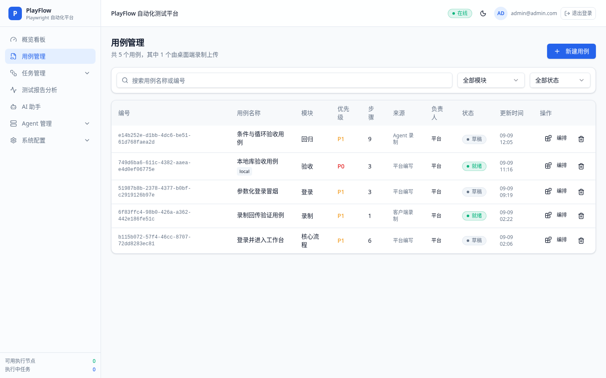
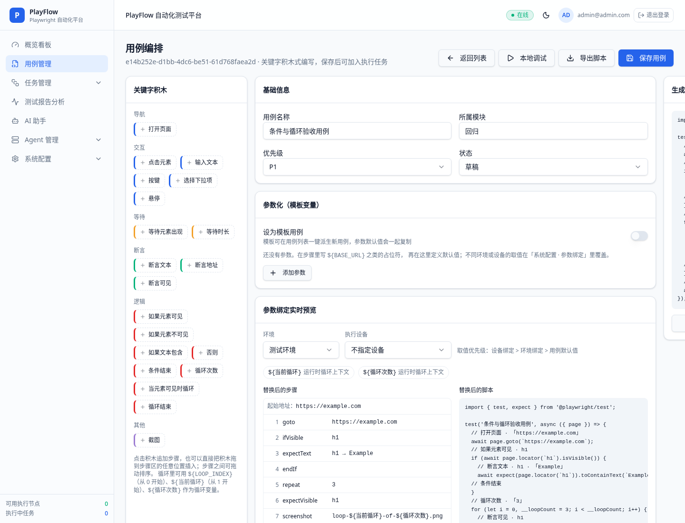
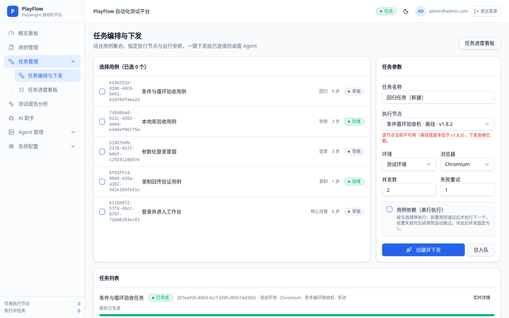
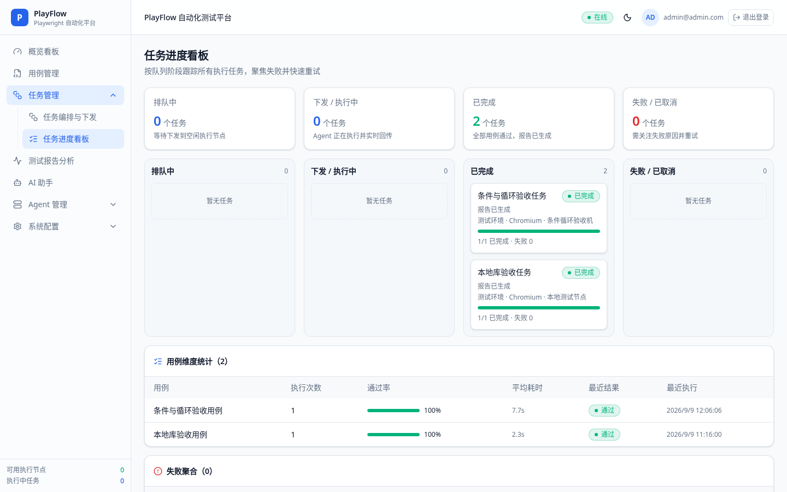
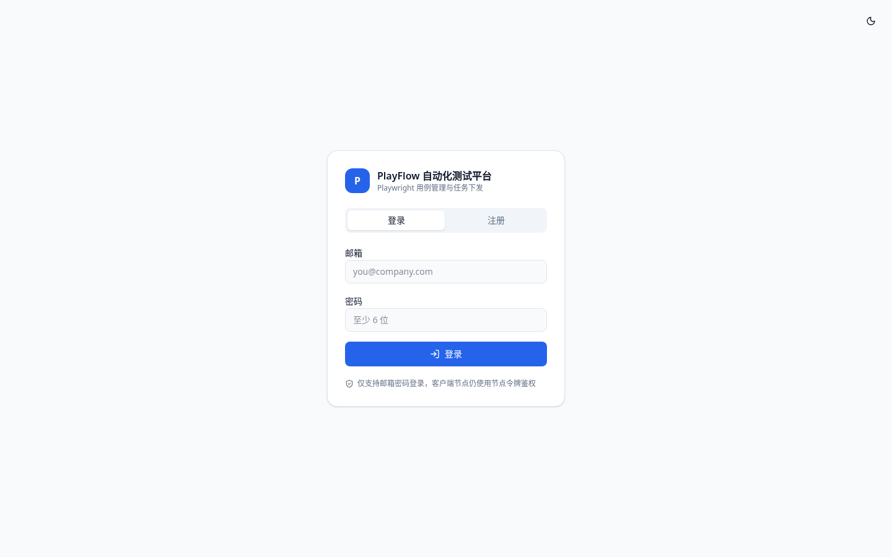
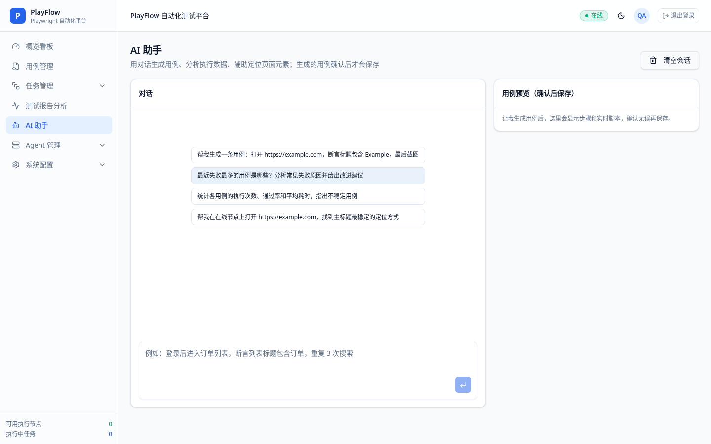
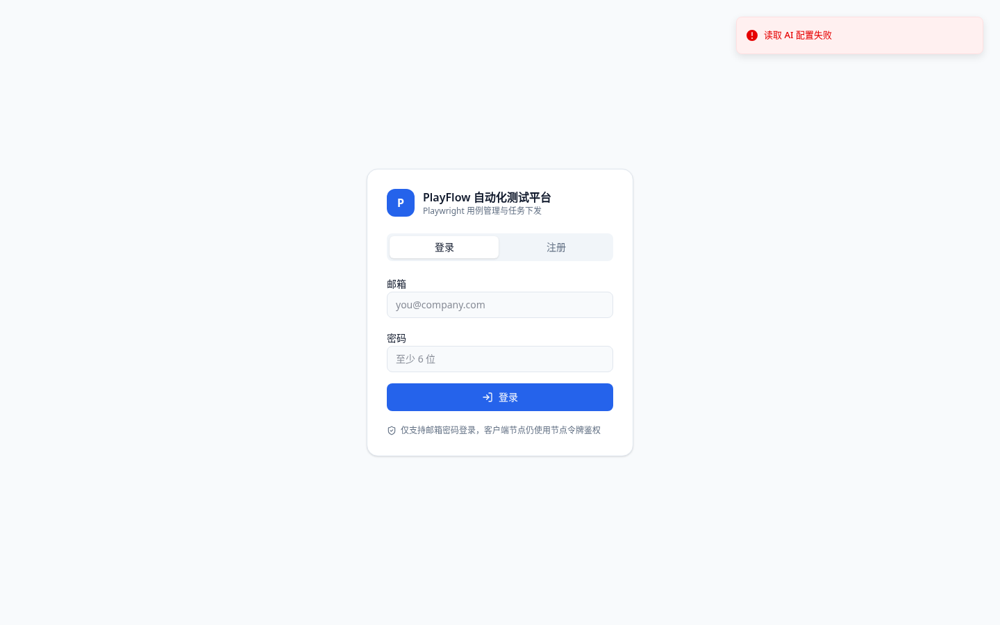

# PlayFlow · Playwright 自动化测试平台

PlayFlow 是一套“平台 + 桌面客户端”的端到端自动化测试解决方案：在网页平台上编排用例与任务，由本地安装的 PlayFlow Agent 用**真实的 Playwright 浏览器**执行，执行日志、截图、版本与报告实时回传平台。界面全中文，Material 风格浅色主题并支持一键深色模式。


---

## 亮点特性

- **真实执行，不是模拟**：Agent 使用本地 Playwright / Chromium 真实驱动浏览器，逐步回传状态、日志、截图与耗时。
- **积木式用例编写**：拖拽关键字积木即可编排步骤，右侧实时生成 Playwright 脚本，可一键导出 `.spec.js`。
- **条件与循环**：内置「逻辑」类关键字（如果元素可见 / 否则 / 条件结束 / 循环次数 / 当元素可见时循环 / 循环结束），支持嵌套并生成真实 `if/else`、`for` 控制流。
- **版本化用例**：每次保存生成版本快照，可回滚到任意历史版本；任务下发时锁定版本号，旧版本在客户端同样可执行。
- **参数化与模板**：用例参数支持默认值、环境绑定、设备绑定（优先级：默认值 < 环境 < 设备），并支持循环变量；下发前可实时预览替换后的步骤与脚本。
- **多设备并行**：任务可同时下发给多台 Agent，队列、进度与日志按设备隔离，一台卡住不影响其他设备。
- **依赖编排**：支持前置用例通过后再执行后续用例，前置失败自动跳过。
- **离线可用**：客户端本地 outbox 队列缓存日志，网络恢复后自动补传；平台数据默认存本地 SQLite，断网也能查看设备与任务。
- **AI 助手**：对话生成用例、AI 页面元素定位（带页面截图与属性缓存）、AI 分析执行数据与报告；生成结果先预览再保存。
- **自建 AI 网关**：AI 设置支持内置模型、OpenAI 兼容、Anthropic 兼容与自定义协议，模型自行添加并可测试连接。

---

## 功能一览

### 用例管理与积木编辑

用例列表按状态、标签与最近执行结果聚合；详情页提供积木编辑器、实时脚本、版本历史、参数绑定预览、录制步骤流程图与逐步日志。




### 任务编排与下发

选择用例、目标节点、环境与并发方式，可按勾选顺序建立串行依赖；下发时自动锁定用例版本并完成参数替换。



### 任务进度看板

展示队列状态、执行阶段、失败原因与重试入口，并提供用例维度统计（执行次数、通过率、平均耗时），失败用例自动置顶。



### 测试报告分析

按任务、环境、浏览器维度汇总通过率、耗时与失败原因分布，可一键生成 AI 摘要。


### Agent 管理

- **执行节点管理**：节点在线/离线、版本校验、资源占用、令牌与升级下发。
- **Agent 仪表盘**：设备在线状态、任务领取数、执行成功率，与任务队列联动。




### AI 助手

对话生成用例、查询执行统计与日志、调用在线 Agent 抓取真实页面元素并推荐定位器。



### 系统配置

基础信息、Agent 与节点校验、执行策略、通知、参数绑定、AI 设置分为独立子页。



---

## 客户端（PlayFlow Agent）

桌面客户端基于 Electron，提供本机工作台与托盘菜单（录制、执行、调试、上传、退出）。


### 安装

1. 在平台「Agent 管理 → 客户端下载更新」页面下载对应安装包：
   - Windows x64：`PlayFlowAgent-<version>-win-x64.zip`
   - macOS Apple Silicon：`PlayFlowAgent-<version>-darwin-arm64.zip`
   - Linux x64：`PlayFlowAgent-<version>-linux-x64.tar.gz`
2. 解压后运行 `PlayFlowAgent`。
3. macOS 若提示“已损坏”，说明包未签名/未公证，可执行：

   ```sh
   xattr -dr com.apple.quarantine /Applications/PlayFlowAgent.app
   ```

   或右键「打开」，并在「系统设置 → 隐私与安全性」中选择「仍要打开」。

### 首次启动

首次启动进入设置页，填写平台地址与设备标识后自动注册并生成节点令牌，无需手动复制粘贴。也可在平台下载页登录后注册设备、查看/复制/重置令牌，再通过环境变量 `PLAYFLOW_AGENT_TOKEN` 注入。

### 日常使用

| 能力 | 说明 |
| --- | --- |
| 录制 | 调起 Playwright codegen 抓取真实操作，生成可执行脚本并上传，平台用例管理中可直接运行 |
| 执行 | 领取平台任务，按锁定版本执行，逐步回传状态、日志与截图 |
| 调试 | 本地单步执行与日志查看 |
| 上传 | 用例脚本与版本自动上传平台，版本号自增 |
| 升级 | 启动与定时检查版本，自动下载安装包、SHA256 校验、安装重启并回传升级结果 |
| 浏览器内核 | 由平台侧统一分发，客户端只下载一次并本地缓存 |

所有 Agent 接口（注册、心跳、任务领取、结果回传、升级回传、元素抓取）均通过节点令牌校验。

---

## 技术栈

- 前端 / 服务端：TanStack Start v1 + React 19 + Vite 7 + Tailwind CSS v4 + shadcn/ui
- 执行引擎：Playwright（真实浏览器）
- 客户端：Electron（主进程 `agent-app/main.cjs`）
- 数据：本地 SQLite（默认 `.data/cases.db`，可用 `CASE_DB_FILE` 指定；预留 MySQL / PostgreSQL 驱动）
- 平台登录：邮箱 + 密码

### 主要环境变量

| 变量 | 用途 |
| --- | --- |
| `CASE_DB_FILE` | 本地 SQLite 数据库文件路径 |
| `CASE_DB_DRIVER` | 数据驱动，默认 `sqlite` |
| `AGENT_DOWNLOAD_BASE` | 安装包下载基址（默认指向 GitHub Release latest） |
| `PLATFORM_URL` | 平台公开地址，供 CI 登记发布记录 |
| `AGENT_RELEASE_TOKEN` | CI 登记发布清单所用令牌 |

---

## 本地开发

```sh
git clone https://github.com/upengfei/playmate-automator.git
cd playmate-automator
npm i
npm run dev
```

平台默认运行在 `http://localhost:8080`。

客户端本地运行：

```sh
cd agent-app
npm i
npx electron .
```

生产构建：

```sh
npm run build
```

---

## 发布流程（CI/CD）

`.github/workflows/agent-release.yml` 在 `main` push 或手动触发时：

1. 构建 Web 产物；
2. 打包 Windows / macOS / Linux 三端 Agent（macOS 可选签名与公证）；
3. 计算 SHA256 生成清单；
4. 创建 GitHub Release 并上传安装包；
5. 使用 `PLATFORM_URL` + `AGENT_RELEASE_TOKEN` 将发布记录登记到平台，下载页地址自动指向最新 Release。

需要在仓库 Secrets 配置：`PLATFORM_URL`、`AGENT_RELEASE_TOKEN`，以及可选的 Apple 签名/公证凭证。

---

## 目录结构

```text
src/routes/            平台页面与 API 路由（含 api/public/agent/* 客户端接口）
src/components/        积木编辑器、流程图、平台外壳等 UI
src/lib/               本地 SQLite 数据层、用例仓库、参数解析、关键字、AI 工具
agent-app/             Electron 客户端（主进程、录制、执行、元素抓取、升级）
docs/screenshots/      README 截图
.github/workflows/     三端打包与 Release 流程
```

---

本项目使用 [Lovable](https://lovable.dev) 构建与持续迭代：[打开项目](https://lovable.dev/projects/165c6921-a6f0-4c7e-adb0-f6ab0760152a)。
